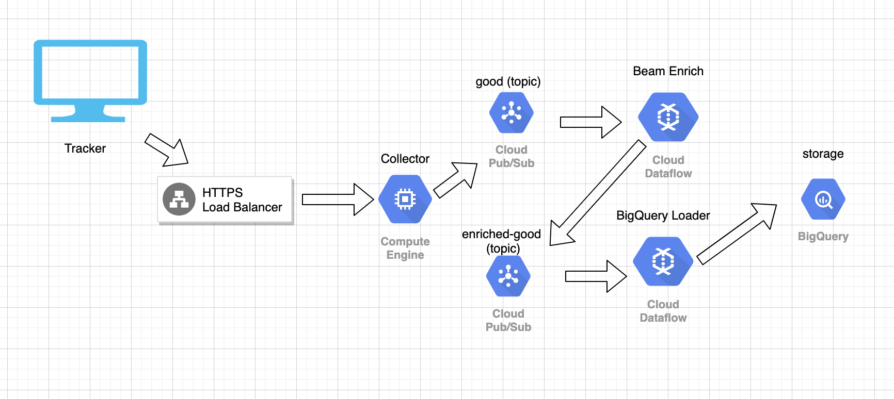

# Snowplow-Local

## Introduction
Snowplow Local is a bundle of collector, Enrich and Loader stitched together to meet requirements 
for easy and fast local evaluation and testing environment for Snowplow Analytics. 

The idea here is to simplify the process of configuring the steps especially to first time user, as for Analytics Developer 
more time can be dedicated towards the tracking side instead of spending hours worth of time on dev-ops.

This blog [Install Snowplow On The Google Cloud Platform][simoahava] has inspired me for comparison of architecture, depending on experience level of your dev-ops, might take hours or days to complete until the bottom of the page. 
The time can be spent instead more towards data modelling and tracking part and leave the rest to the dev-ops for production deployment.

Original design of deployment illustrated below:


Simplified version:


Snowplow-Local should be used for non-production environment only i.e local or staging.

## Installation

I wish it could be more simpler but I expect here you should at least know how to execute command using terminal or console.

1. Download and install [jdk]. Ensure the version is 8.
2. Download the file: [Release.zip][zip]
3. Decompress it `unzip snowplow-local.zip`
4. Enter into the directory `cd snowplow-local`
5. Run the jar file. `java -jar snowplow-local-0.1.jar --config confs/application.conf`


### Test Tracker

I've included an example of web tracker inside example folder. You will need to use local web host to test, 
For completeness purpose, I'll demonstrate using PHP command. However any local webhost should do the work such as xampp.

```$bash
$ cd example
$ php -S 0.0.0.0:8081
```

Open http://localhost:8081/index.html using web browser.

If everything runs correctly, you will start seeing json files created in ```enriched``` folder.

### Configurations

In the application.conf there are few lines added to handle enrichment steps as outlined below:
```hocon
enrich {
    enriched = "enriched",
    bad = "bad",
    resolver = "confs/iglu_resolver.json",
    enrichments = "confs/enrichments"
  }
```

* `enriched`: the destination directory for successfully enriched events
* `bad`: the destination directory for failed enriched events
* `resolver`: path to iglu resolver configuration file
* `enrichments`: optional path to [configurable enrichments][conf-enrich]

Other than that you should consult the official documentation of [scala stream collector][setup] 


## Compile from source

1. Install [sbt]
2. `git clone https://github.com/mahadirz/snowplow-local.git`
3. `cd snowplow-local`
4. Compile and assemble into jar: `sbt "project stdout" assembly`
5. The assembled jar file is located in stout/target/scala-{version}/snowplow-local-{version}.jar


## Copyright and license

The Scala Stream Collector is copyright 2013-2019 Snowplow Analytics Ltd.

Licensed under the [Apache License, Version 2.0][license] (the "License");
you may not use this software except in compliance with the License.

Unless required by applicable law or agreed to in writing, software
distributed under the License is distributed on an "AS IS" BASIS,
WITHOUT WARRANTIES OR CONDITIONS OF ANY KIND, either express or implied.
See the License for the specific language governing permissions and
limitations under the License.

[conf-enrich]: https://github.com/snowplow/snowplow/wiki/Configurable-enrichments
[zip]: https://github.com/mahadirz/snowplow-local/releases/download/v.0.1/snowplow-local.zip
[simoahava]: https://www.simoahava.com/analytics/install-snowplow-on-the-google-cloud-platform/
[snowplow]: http://snowplowanalytics.com
[jdk]: https://www.oracle.com/technetwork/java/javase/downloads/jdk8-downloads-2133151.html
[sbt]:https://www.scala-sbt.org/
[thrift]: http://thrift.apache.org
[kinesis]: http://aws.amazon.com/kinesis
[akka-http]: http://doc.akka.io/docs/akka-http/current/scala/http/introduction.html
[nsq]: http://nsq.io/

[techdocs-image]: https://d3i6fms1cm1j0i.cloudfront.net/github/images/techdocs.png
[setup-image]: https://d3i6fms1cm1j0i.cloudfront.net/github/images/setup.png
[roadmap-image]: https://d3i6fms1cm1j0i.cloudfront.net/github/images/roadmap.png
[contributing-image]: https://d3i6fms1cm1j0i.cloudfront.net/github/images/contributing.png

[techdocs]: https://github.com/snowplow/snowplow/wiki/Scala-Stream-collector
[setup]: https://github.com/snowplow/snowplow/wiki/Setting-up-the-Scala-Stream-collector
[roadmap]: https://github.com/snowplow/snowplow/wiki/Scala-Stream-collector-roadmap
[contributing]: https://github.com/snowplow/snowplow/wiki/Scala-Stream-collector-contributing

[license]: http://www.apache.org/licenses/LICENSE-2.0
